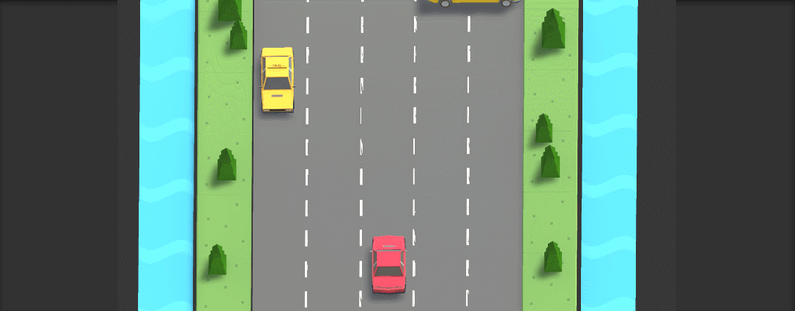
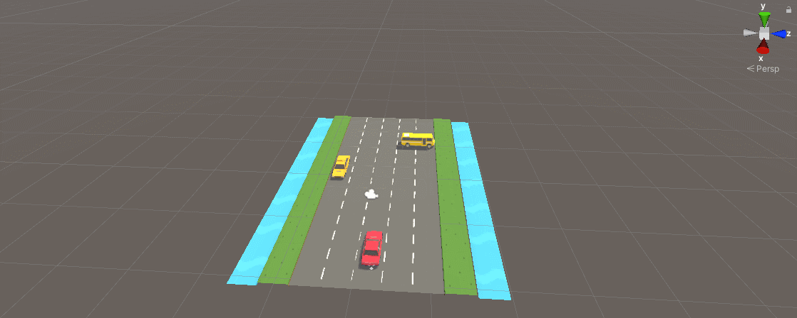
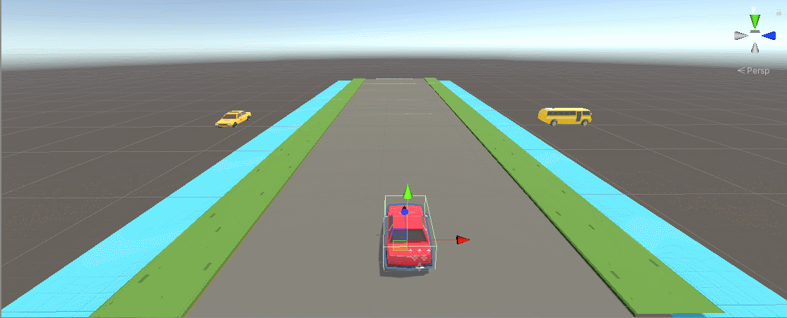
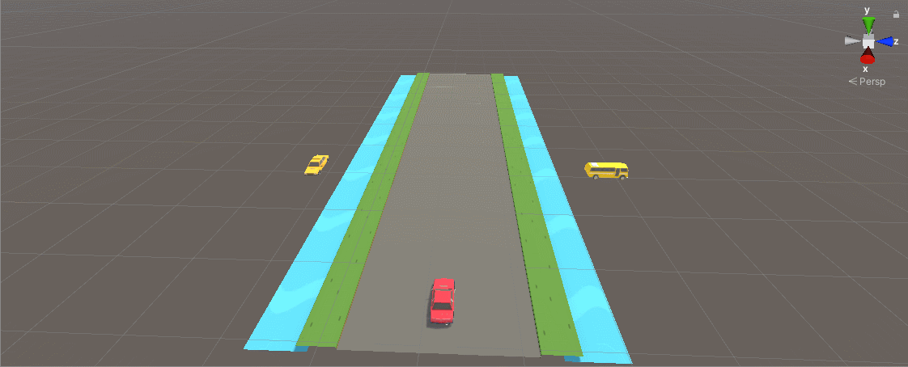
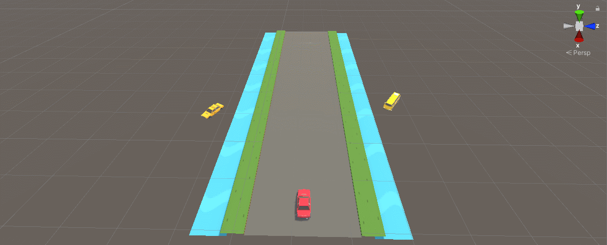
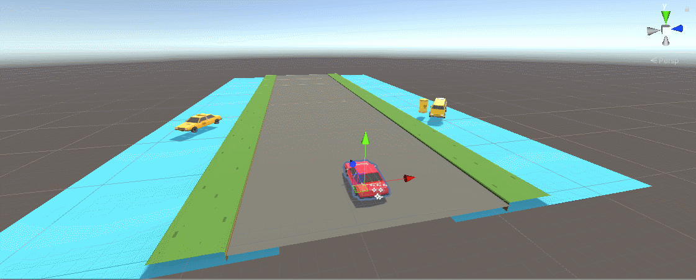
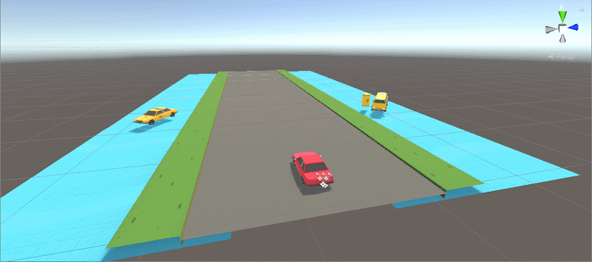
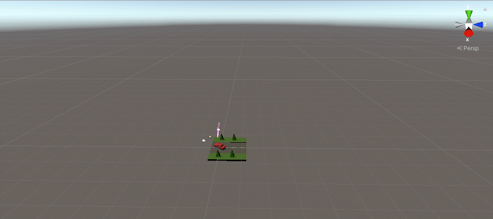

# Together-CarCarCar
다함께 차차차 게임 모작 / 유니티 연습

## 프로젝트 시작 2020.05.13
#### 0513
</img>   
플레이어 차 이동, 점프 구현

#### 0514
</img>    
나무와 도로 라인 이동 효과 추가 및 차 매연 추가   
카메라 각도 변경(더 자연스러워진 듯)

#### 0515
</img>    
스테이지 개념 추가 (txt 파일로 추가 가능)   
택시 장애물 추가(플레이어와 반대방향으로 달리는 장애물 차)(충돌 구현 아직 안함)

#### 0516
</img>    
버스 장애물 추가(멈춰있는 2칸짜리 장애물 차)(충돌 구현 아직 안함)   
스테이지 끝나는 라인 선 추가

#### 0517
</img>    
스테이지 매니저 코드 개선(배열 간소화, 3중 for -> 2중 for using queue)   
시작, 종료, 충돌 코루틴 구현   
충돌 로직 구현   

#### 0518
</img>    
충돌 이펙트 구현(날라가는 장애물 차, 폭발 이펙트, 플레이어차가 깜빡이는 시각적 효과)   
진행상황 바 추가 및 타이머 추가

#### 0519
</img>    
position 이동 코드들 time delta 이용하도록 변경   
부스터 아이템 추가   
점프 및 횡방향 이동시 작은 모션 추가   

#### 0520
</img>    
장애물들끼리의 충돌 효과도 추가   
스테이지 마무리 시 드리프트 및 조작 불가 설정   
각종 버그 수정...

#### 0521
</img>    
시작 화면 Scene 추가      
시작 버튼 추가 및 씬 연계 기능 구현   

## TODO
1. UI
2. 이펙트