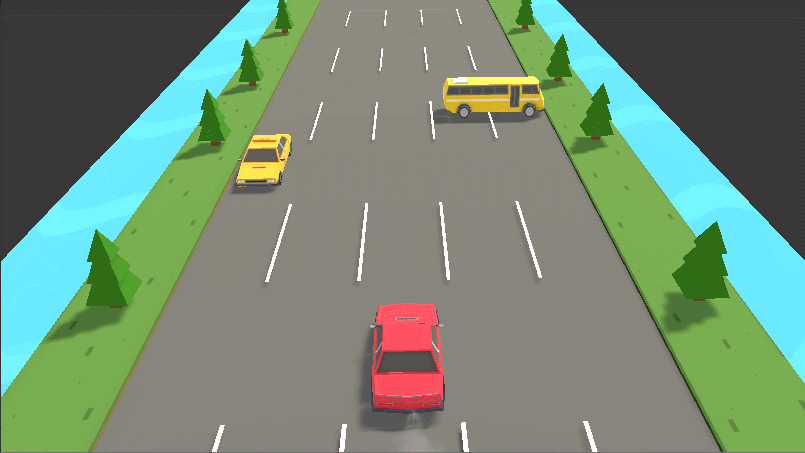

# Together-CarCarCar
다함께 차차차 게임 모작 / 유니티 연습

## 프로젝트 시작 2020.05.13
### 0513
</img>   
플레이어 차 이동, 점프 구현
### 0514
</img>    
나무와 도로 라인 이동 효과 추가 및 차 매연 추가   
카메라 각도 변경(더 자연스러워진 듯)
### 0515
</img>    
스테이지 개념 추가 (txt 파일로 추가 가능)   
택시 장애물 추가(플레이어와 반대방향으로 달리는 장애물 차)(충돌 구현 아직 안함)